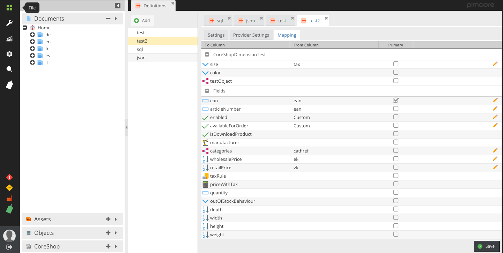

[](LICENSE.md)
[](https://packagist.org/packages/instride/data-definitions)

Data Definitions allows you to define your DataObject Imports and Exports using a nice GUI and re-run the definitions
as often you like. Everything within Data Definitions is extendable.



## Requirements
* Pimcore 11

## Getting started
```bash
# Install via composer
composer require instride/data-definitions
```

```php
// Add to config/bundles.php
return [
    // ...
    Instride\DataDefinitionsBundle\DataDefinitionsBundle::class => ['all' => true],
];
```

```bash
# Install the bundle via command-line
bin/console pimcore:bundle:install DataDefinitionsBundle
```

 * Reload Pimcore
 * Open Settings -> Import Definitions or Export Definitions

## Documentation
 - [Import Definitions](./docs/imports.md)
 - [Export Definitions](./docs/exports.md)

## License
**instride AG**, Sandgruebestrasse 4, 6210 Sursee, Switzerland  
[instride.ch](https://instride.ch), connect@instride.ch  
Copyright © 2024 instride AG. All rights reserved.

**CORS GmbH**, Zeileisstraße 6, 4600 Wels, Österreich
[cors.gmbh](https://cors.gmbh), info@cors.gmbh  
Copyright © 2024 CORS GmbH. All rights reserved.


For licensing details please visit [LICENSE.md](LICENSE.md)
