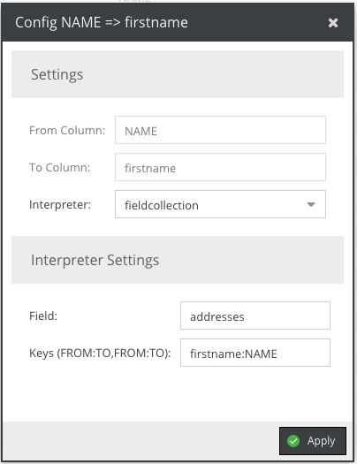
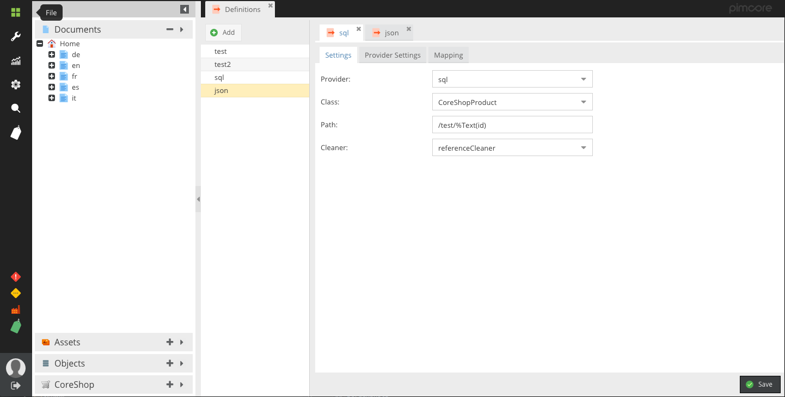

# Pimcore - Import Definitions

**Looking for the current stable (version 1)? See https://github.com/w-vision/ImportDefinitions/tree/1.2**

[](LICENSE.md)
[](https://packagist.org/packages/w-vision/import-definitions)

Import Definitions allows you to define your Object Import using a nice GUI and re-run the imports as often you like. Everything within Import Definitions is extendable.


## Requirements
* Pimcore 5. Only with Build 105 or greater.

## Getting started/Installation

 * Since Import-Definitions depends on CoreShops ResourceBundle, and the ResourceBundle only exists in DEV yet, you need to set your "minimum-stability" to "dev" in your composer.json
 * Install via composer ```composer require w-vision/import-definitions:^2.0-dev```
 * Load needed Bundles:
    ```php
    <?php

    // app/AppKernel.php
    public function registerBundlesToCollection(BundleCollection $collection)
    {
        $collection->addBundles(array(
            new \JMS\SerializerBundle\JMSSerializerBundle(),
            new \CoreShop\Bundle\ResourceBundle\CoreShopResourceBundle(),
            new \FOS\RestBundle\FOSRestBundle(),
            new \Doctrine\Bundle\DoctrineCacheBundle\DoctrineCacheBundle(),
            new \Stof\DoctrineExtensionsBundle\StofDoctrineExtensionsBundle()
        ), 120);
    }
    ```
 * Enable Bundle by running ```bin/console pimcore:bundle:enable ImportDefinitionsBundle```
 * Clear Cache by running ```bin/console cache:clear --no-warmup```
 * Install Bundle by running ```bin/console pimcore:bundle:install ImportDefinitionsBundle```
 * Reload Pimcore
 * Open Settings -> Import Definitions

## Providers
Currently, only 4 types of providers are available:

 - CSV
 - JSON
 - XML
 - SQL

Because, the data needs to be non-hierarchial, XML and JSON are very limited. You can write your own provider to prepare the data for the plugin. To do that, you simply
need to create a new class and implement ```ImportDefinitionsBundle\Provider\ProviderInterface``` namespace and add a new service:

```yml
acme_bundle.import_definition.provider.my_provider:
    class: AcmeBundle\ImportDefinitions\MyProvider
    tags:
      - { name: import_definition.provider, type: my_provider, form-type: AcmeBundle\Form\Type\MyProviderType }
```

Take a look at the existing Providers to get a clue how they are working.

## Cleaner
A cleaner takes care about the clean-up process. It basically deletes or unpublishes the missing objects. Following Cleaners are currently available:

 - Deleter: Deletes missing objects
 - Unpublisher: Unpublishes missing objects
 - Reference Cleaner: Deletes only when no references exists, otherwise the object will be unpublished
 - None: does basically nothing

To create your own cleaner you need to implement ```ImportDefinitionsBundle\Cleaner\CleanerInterface``` and add a new service

```yml
acme_bundle.import_definition.my_cleaner:
    class: AcmeBundle\ImportDefinitions\MyCleaner
    tags:
      - { name: import_definition.cleaner, type: my-cleaner }
```


## Interpreter
To prepare data before it goes to the Objects-Setter Method, there are these "Interpreters". Currently following are available:

 - AssetsUrl -> Downloads an Asset from an Url and saves it to a multihref field
 - AssetUrl -> Downloads an Asset from an Url and saves it to a href field
 - DefaultValue -> Saves a Static-Value (definied in the UI) to the field
 - Checkbox -> transform "yes" and "no" into a Boolean Value
 - Href -> solves the connection from an ID to an actual Pimcore Object
 - MultiHref -> same as href, but for multihref fields
 - Quantity Value -> Interprets the data as Pimcore quantity value
 - Nested -> Allows you to nest/chain interpreters and pass results from one to another

This probably doesn't satisfy your needs. But you can also write your own Interpreters.
Todo that, you need to implement the interface ```ImportDefinitionsBundle\Interpreter\InterpreterInterface``` and create a service

```yml
acme_bundle.import_definition.my_interpter:
    class: AcmeBundle\ImportDefinitions\MyInterpreter
    tags:
      - { name: import_definition.interpreter, type: myinterpreter, form-type: ImportDefinitionsBundle\Form\Type\Interpreter\NoConfigurationType }
```

If your Interpter does have configuration as well, you need to create a new FormType and add a new Javascript file for the GUI:

```javascript
pimcore.registerNS('pimcore.plugin.importdefinitions.interpreters.myinterpreter');

pimcore.plugin.importdefinitions.interpreters.myinterpreter = Class.create(pimcore.plugin.importdefinitions.interpreters.abstract, {

});

```

You also need to load your Javascript File in your config.yml

```yml
import_definitions:
  pimcore_admin:
    js:
      my_interpter: '/static/pimcore/myinterpter.js'
```

## Setter
A Setter sets the data to the object as it would be needed.

 - Objectbrick -> saves the data to an objectbrick
 - Localizedfield -> saves the data to the specific language field
 - Classificationstore -> Saves the data to a classificationstore field
 - Fieldcollection -> Saves the data to a fieldcollection
 - Key -> Sets Object Key to a more dynamic value
 - ObjectType -> Sets Object Type to a more dynamic value

Of course, you can also implement your own Setters. Its basically the same as with Interpreters.

Todo that, you need to implement the interface ```ImportDefinitionsBundle\Setter\SetterInterface``` and create a service

```yml
acme_bundle.import_definition.my_interpter:
    class: AcmeBundle\ImportDefinitions\MySetter
    tags:
      - { name: import_definition.setter, type: mysetter, form-type: ImportDefinitionsBundle\Form\Type\NoConfigurationType }
```

If your Setter does have configuration as well, you need to create a new FormType and add a new Javascript file for the GUI:

```javascript
pimcore.registerNS('pimcore.plugin.importdefinitions.setters.mysetter');

pimcore.plugin.importdefinitions.setters.mysetter = Class.create(pimcore.plugin.importdefinitions.setters.abstract, {

});

```


You also need to load your Javascript File in your config.yml
```yml
import_definitions:
  pimcore_admin:
    js:
      my_setter: '/static/pimcore/mysetter.js'
```


## Filter
A Filter, as the name says, filters your data on runtime. Your method gets called on every "row" and you get to decide if you want to import it, or not.

To implement a new filter, you need to implement the interface ```ImportDefinitionsBundle\Filter\FilterInterface``` and add a new service

```yml
acme_bundle.import_definition.my_filter:
    class: AcmeBundle\ImportDefinitions\MyFilter
    tags:
      - { name: import_definition.filter, type: my_filter }
```

```php
namespace AcmeBundle\ImportDefinitions;

class MyFilter implements FilterInterface
{
    public function filter($definition, $data, $object) {
        if($data['isActive'])
        {
            return true;            //Will be imported
        }

        return false;               //Will be ignored
    }
}
```

## Runner
A runner gets called before and after every line is imported from your data-source. This can help you do clean-up or similar stuff.

To implement a new Runner, you need to implement the interface ```ImportDefinitionsBundle\Runner\RunnerInterface``` and add a new service

```yml
acme_bundle.import_definition.my_runner:
    class: AcmeBundle\ImportDefinitions\MyRunner
    tags:
      - { name: import_definition.runner, type: my_runner }
```

```php
namespace AcmeBundle\ImportDefinitions;

class MyRunner implements RunnerInterface
{
    public function preRun(Concrete $object, $data, DefinitionInterface $definition, $params) {
        //gets called before the row gets imported
    }

    public function postRun(Concrete $object, $data, DefinitionInterface $definition, $params) {
        //gets called after the row was imported
    }
}
```

## Placeholders for Keys and Paths
Import Definitions allow you to specify a key and a path for the objects. To be really generic, you can use pimcores placeholders for that.

[https://www.pimcore.org/docs/5.0.0/Development_Tools_and_Details/Placeholders/index.html](https://www.pimcore.org/docs/5.0.0/Development_Tools_and_Details/Placeholders/index.html)


## Fieldcollections
Fieldcollections are something special here. Because they can (and will) have a 1:n relation, the connection between the Data and the Mapping is special.



As you can see in the screenshot above, we have to settings to make:

 - Field: Of course, the field from the Main Object
 - Keys: This is were the magic happens. Because fieldcollection may have a 1:n relation, we need to somehow map the Primary Key of the fieldcollection. This is done
  using a special CSV Syntax "FROM:TO,FROM:TO". The Interpreter will split the keys and search for the appropriate entry in the collection. If found, it will change the value,
  if its new, it will create a new entry. Because of the UI, you need to add this value to each entry of your fieldcollection mapping.

## List your Definitions (in CLI)

Run following command

```cli
bin/console import-definitions:list
```

You can see the ID, the name and the Provider

## Run your definition
Definitions can only run (at the moment) using the Pimcore CLI. To run your definition, use following command

```cli
bin/console import-definitions:import -d 1 -p "{\"file\":\"test.json\"}"
```

## Copyright and license 
Copyright: [Woche-Pass AG](http://www.w-vision.ch)
For licensing details please visit [LICENSE.md](LICENSE.md) 

## Screenshots


